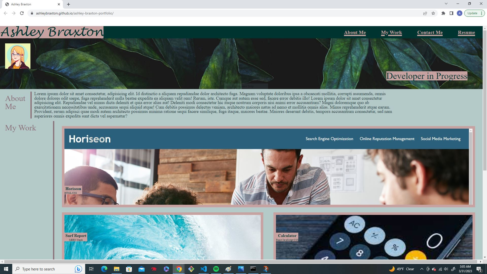

# ashley-braxton-portfolio
## Description

This is a portfolio that will allow me to store my projects, along with information about myself and contact information. This can be shared with potential employers.

## Usage
The navigation bar at the top of the page will take the user to the desired section. The project images in the 'my work' section are all clickable and will take the user to that specific webpage. The contact me links at the bottom are also clickabel and will leac to the corresponding form of contact.

## Credits
The avatar image was created with Picrew’s “nyurei's avatar creator !!“!!  https://picrew.me/share?cd=fXWy0RiLlb #Picrew #nyureis_avatar_creator_ so credits to that go to them.

## License

MIT
